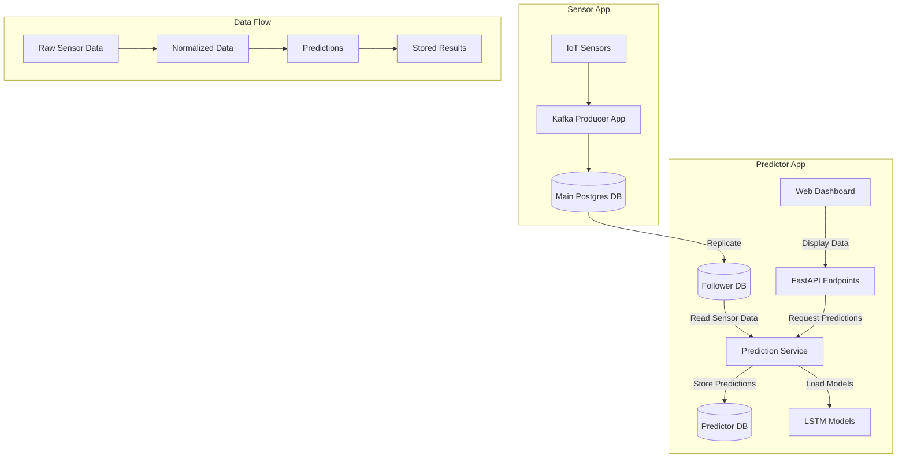

# IoT LSTM Predictor

Real-time IoT sensor data prediction system using LSTM neural networks. This system connects to a follower database from a Kafka-based IoT sensor application, makes predictions using trained LSTM models, and stores the predictions for visualization.

## System Architecture



## Prerequisites

- Python 3.11.7
- PostgreSQL
- Heroku CLI (for deployment)
- Access to IoT Sensor App's database

## Setup

1. Install Python 3.11.7 using pyenv:
```bash
pyenv install 3.11.7
```

2. Create and activate virtual environment:
```bash
pyenv local 3.11.7
pyenv virtualenv 3.11.7 iot-lstm-predictor
```

3. Install dependencies:
```bash
pip install -r requirements.txt
```

4. Database Setup:
   - Set up the follower database connection from the Kafka sensor app
   - Create a new database for storing predictions
   - Update .env file with both database URLs:
     ```
     DATABASE_URL=<follower_database_url>
     HEROKU_POSTGRESQL_PURPLE_URL=<prediction_database_url>
     ```

5. Initialize prediction database:
```bash
python migrations/create_prediction_tables.py
```

6. Run development server:
```bash
uvicorn app.main:app --reload
```

## Project Structure

```
IoT-LSTM-Predictor/
├── app/
│   ├── models/      # Database & ML models
│   │   ├── db_models.py     # SQLAlchemy models
│   │   └── lstm_model.py    # LSTM model definitions
│   ├── api/         # API endpoints
│   ├── services/    # Business logic
│   │   ├── prediction.py    # Prediction service
│   │   └── training.py      # Model training service
│   └── utils/       # Utility functions
│       ├── data_prep.py     # Data preprocessing
│       └── db_utils.py      # Database utilities
├── config/          # Configuration
├── migrations/      # Database migrations
├── models/         # Trained model storage
│   ├── sensor_1_model/
│   ├── sensor_2_model/
│   └── .../
├── notebooks/      # Jupyter notebooks
└── tests/         # Test suite
```

## Key Components

### 1. Sensor Data Access
- Reads real-time sensor data from a follower database
- Connected to Kafka sensor application
- Read-only access to ensure data integrity

### 2. LSTM Models
- Pre-trained models for each sensor
- Predicts temperature and humidity values
- Models stored in `/models` directory

### 3. Prediction Service
- Handles data preprocessing
- Performs model inference
- Manages prediction storage
- Implements error handling and logging

### 4. Databases
- Follower DB: Read-only access to sensor data
- Predictor DB: Stores predictions and model metadata
- Both using PostgreSQL

### 5. API Endpoints
- FastAPI routes for prediction requests
- Data access endpoints
- Web dashboard integration

## Development

### Testing
Run the prediction pipeline test:
```bash
python test_predictions.py
```

### Local Development
1. Set up local PostgreSQL databases
2. Update .env file with local credentials
3. Run development server:
```bash
uvicorn app.main:app --reload --port 8000
```

## Deployment

### Heroku Setup
1. Create a new Heroku app:
```bash
heroku create your-app-name
```

2. Add PostgreSQL add-ons:
```bash
heroku addons:create heroku-postgresql:mini -a your-app-name
```

3. Set up follower database:
   - Attach the sensor app's database as a follower
   - Configure read-only access

4. Deploy the application:
```bash
git push heroku main
```

### Environment Variables
Set the following on Heroku:
- `DATABASE_URL`: Follower database URL
- `HEROKU_POSTGRESQL_PURPLE_URL`: Prediction database URL
- `ENVIRONMENT`: "production"
- `SECRET_KEY`: Your secret key

## Monitoring and Maintenance

### Database Monitoring
- Check follower database replication lag
- Monitor prediction database growth
- Regular backup of prediction data

### Model Performance
- Track prediction accuracy
- Monitor for model drift
- Regular model retraining as needed

### Application Logs
- Monitor Heroku logs for errors
- Track prediction service performance
- Database connection issues

## Contributing

1. Fork the repository
2. Create your feature branch
3. Commit your changes
4. Push to the branch
5. Create a new Pull Request

## License

This project is licensed under the MIT License - see the LICENSE file for details.